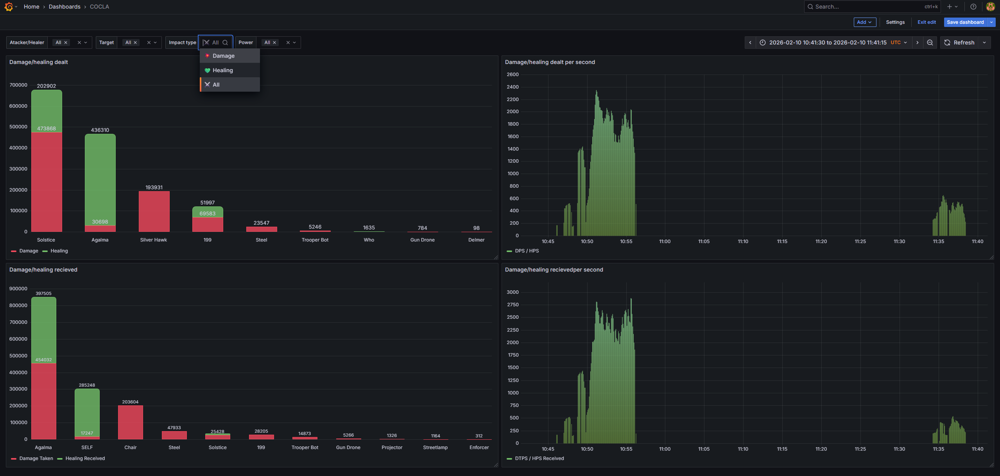

# 🚀 Champions Online Combat Log Analyzer (COCLA)

[](https://opensource.org/licenses/MIT)
[](https://github.com/micezipper/cocla/releases)

| | Branch | Status | Description |
|---|--------|--------|-------------|
| 🚧 | **Development** (`release/dev`) | [](https://github.com/micezipper/cocla/actions/workflows/maven-dev.yml) | Active development, bug fixes |
| 🏷️ | **Release** (`main`) | [](https://github.com/micezipper/cocla/actions/workflows/maven.yml) | Stable releases |

Headless Java application for forwarding Champions Online combat logs to MySQL database for Grafana visualization.

## ✨ Features

- 📊 **Real-time combat log monitoring** - Automatically detects and parses new log entries
- 🗄️ **MySQL database storage** - Optimized schema with proper indexing
- 📈 **Grafana integration** - Pre-configured dashboard with 4 panels:
  - DPS Bar Chart (top damagers)
  - DPS Time Series (damage over time)
  - Damage Taken Bar Chart (top tanks)
  - Damage Taken Time Series (damage received over time)
- 🔧 **Simple configuration** - Single config.properties file
- 🎯 **Impact type tracking** - Critical, Kill, Dodge, Immune and more
- 👥 **Entity classification** - Automatically distinguishes Players from Creatures

## 📋 Prerequisites

| Component | Version | Required | Notes |
|-----------|---------|----------|-------|
| ☕ **Java** | 15+ | ✅ Yes | Runtime environment |
| 🏗️ **Maven** | 3.9.x | ❌ No | Only for building from source |
| 🗄️ **MySQL/MariaDB** | 8.0+ / 10.5+ | ✅ Yes | Database storage |
| 📊 **Grafana** | 12.2.1+ | ✅ Yes | Visualization dashboards |
| 🎮 **Champions Online** | any | ✅ Yes | Game with combat logging enabled |

## 🚀 Quick Start
Coming soon in v1.1

## 🛠️ Manual installation Guide

### 1. Database Setup
```bash
# Create database and users
mysql -u root -p < config/mariadb/schema.sql
```

### 2. Build the Application
```bash
# Using Maven
mvn clean package

# The JAR file will be in target/cocla-*.jar
```

### 3. Configure COCLA
```bash
# Copy example configuration
cp config/cocla/config.properties.example config.properties

# Edit with your settings
nano config.properties  # or any text editor
```

### 4. Grafana Setup
1. Navigate to your Grafana instance (e.g., http://localhost:3000)
2. Add a MySQL data source:
   - Name: ``mysql-cocla``
   - Host: ``localhost:3306``
   - Database: ``cocla``
   - User: ``cocla``
   - Password: ``cocla``
   - Session timezone: ``+00:00`` (required to display time correctly)
3. Import the dashboard:
   1. Click + → **Import**
   2. Upload ``config/grafana/dashboard.json``
   3. Select ``mysql-cocla`` as the data source
  
### 5. Run COCLA
```bash
java -jar target/cocla-*.jar
```

### 6. Start Logging
1. Launch Champions Online
2. Put the following command in the chatbox and hit Enter
```bash
/CombatLog 1
```
3. COCLA will automatically detect and process new logs
4. if you want to stop logging put the following command
```bash
/CombatLog 0
```

## 📦 Third-Party Components

COCLA portable distribution includes the following third-party software.
All components are included as-is without modification.

| Component | Version | License | Source |
|-----------|---------|---------|--------|
| **OpenJDK** | 26+35 | GPLv2 with Classpath Exception | [https://github.com/openjdk/jdk](https://github.com/openjdk/jdk) |
| **MariaDB** | 12.2.2 | GPLv2 | [https://github.com/MariaDB/server](https://github.com/MariaDB/server) |
| **Grafana** | 13.0.1 | AGPLv3 | [https://github.com/grafana/grafana](https://github.com/grafana/grafana) |
| **HikariCP** | 7.0.2 | Apache 2.0 | [https://github.com/brettwooldridge/HikariCP](https://github.com/brettwooldridge/HikariCP) |
| **MySQL Connector/J** | 8.0.33 | GPLv2 with FOSS Exception | [https://github.com/mysql/mysql-connector-j](https://github.com/mysql/mysql-connector-j) |

### License Notes

1. **OpenJDK** — Free and open-source. No restrictions on redistribution.
2. **MariaDB** — GPLv2. Including unmodified binaries in a larger distribution is permitted under GPL.
3. **Grafana** — AGPLv3. Source code must be made available to users. Link to repository provided above.
4. **HikariCP** — Apache 2.0. Permits inclusion in both open-source and proprietary software.
5. **MySQL Connector/J** — GPLv2 with FOSS Exception. Allows use with open-source applications without GPL infecting your code.

### Source Availability

All third-party source code is available at the URLs listed above.
COCLA itself is licensed under the MIT License.
